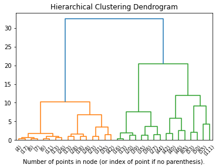

# Implementation of Linkage Based Clustering

In this homework you will implement the Single Linkage Clustering.
Since the topic was not covered in the class feel free to look at this material if you need.

Hierarchical Agglomerative Clustering [HAC - Single Link]: https://youtu.be/RdT7bhm1M3E.

